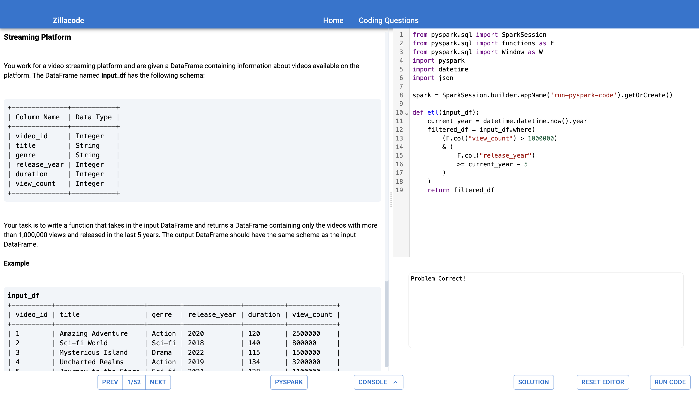

<p align="center">
  
</p>

# Zillacode - _Open Source LeetCode for PySpark, Spark, Pandas and DBT/Snowflake_


Zillacode is the only platform on the internet where you can practice 50+ LeetCode like questions using PySpark, Spark, DBT and Snowflake. The entire platform spins up on any machine with one command using Docker Compose.

In addition to solving Zillacode problems you can also learn from the repo itself. Zillacode was once a live micro-serviced B2C SAAS platform deployed using the AWS serverless stack. All of the Infrastructure as Code files have been left in place for anyone who wants to learn about Devops or try to deploy it themselves.

### Run Locally

```bash
$ git clone https://github.com/davidzajac1/zillacode.git
$ cd zillacode
$ docker-compose up
```

Then navigate to [http://localhost:5173](http://localhost:5173)

### Optional - Configuring Snowflake

Note Snowflake is not Open Source thus to solve problems with DBT/Snowflake you need to add a `.env` file with Snowflake credentials in the `backend` directory. All problems except for DBT/Snowflake problem will work normally without the `.env` file.

```
SNOWFLAKE_USERNAME=<SNOWFLAKE_USERNAME>
SNOWFLAKE_PASSWORD=<SNOWFLAKE_PASSWORD>
SNOWFLAKE_ACCOUNT=<SNOWFLAKE_ACCOUNT>
SNOWFLAKE_WAREHOUSE=<SNOWFLAKE_WAREHOUSE>
```

You can set up your own Snowflake account, all queries run by Zillacode will not result in any spend as they all just compile as Common Table Expressions without querying any tables. Your Snowflake user must have permissions to use your Snowflake warehouse.

### Questions/Issues

For any bugs/issues please make an Issue in GitHub. See the Contributing section on how to make a Pull Request if you want to fix the problem yourself.

Feel free to ask any questions about the project or anything Data Engineering, Spark, etc. related in a GitHub Discussion. All announcements about the project will be made in GitHub Discussions as well.

<p align="center">
  
</p>

## Development/Contributing

All contributions from Issues to Pull Requests are greatly appreciated!

Zillacode runs locally using Docker Compose and is divided into 5 microservices. The app can be run as is just by running `make up` but if you want to make changes see the sections below for how development works with each service.

Note Zillacode at was originally a SAAS product but now the project is just designed to run locally with Docker Compose, but all of the Terraform/Zappa/GitHub Actions config files are left in the project for anyone who wants to try to deploy it to the cloud.

### Pull Requests

To make a Pull Request fork the project then make a Pull Request to the `master` branch. Please be specific about the changes you are making.

### Installations

- [Make](https://gnuwin32.sourceforge.net/packages/make.htm)
- [Docker](https://docs.docker.com/get-docker/)
- [Node](https://nodejs.org/en/download/)
- [Yarn](https://classic.yarnpkg.com/lang/en/docs/install/#windows-stable)
- [React Dev Tools](https://reactjs.org/blog/2015/09/02/new-react-developer-tools.html#installation)
- [Python](https://www.python.org/downloads/)
- [Pipenv](https://github.com/pypa/pipenv)
- [Pre-Commit](https://pre-commit.com/#installation)

### Frontend

For making frontend changes, spin up the backend in the background using Docker by running `make up-backend`, this will spin up the backend on http://localhost:5000. Then run `make serve-frontend` to serve the frontend on http://localhost:3000. The frontend will send requests to the backend hosted locally.

For adding new dependencies run `make add package=<PACKAGE TO INSTALL>`.

To clean up run `make down` to shut down the backend containers Docker is running.

### Backend Microservices

The backend is comprised of 4 separate services hosted on [AWS Lambda](https://aws.amazon.com/lambda/). To rebuild changes made to any of these services run `make rebuild container=<backend|spark|scala-spark|db-lambda>`.

#### Flask Lambda

The Zillacode backend API is a [Flask](https://flask.palletsprojects.com/) application that receives HTTP requests from the frontend. This service is contained in the `backend` directory. All endpoints thus to create a new endpoint you only need to change the Python code in the `./backend/app.py` file.

#### Spark Lambda

The Spark Lambda is used to run PySpark code and is built from a Docker Image. It is contained in the `spark-lambda` directory.

#### Scala Spark Lambda

The Scala Spark Lambda is essentially the same as the Spark Lambda but is used to run Scala code. It is contained in the `scala-spark-lambda` directory. The Scala Spark Lambda image is built using `sbt`, a common Scala build framework. It is slow and may take about 15 minutes to build the Docker image.

#### DB Lambda

This Lambda is used to run Python Pandas code. It is separated from the backend Flask App because it uses the Python `exec()` function to remotely execute code thus it needs to be in its own service that has no permissions and can't make outbound connections.
